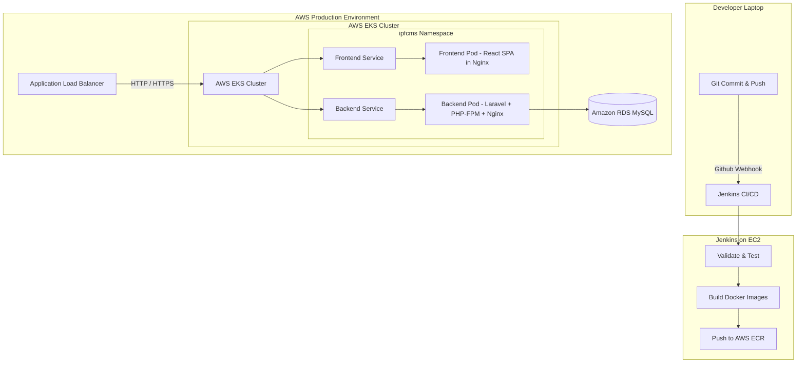

# 🚀 IPFC Management Software — Production Deployment Guide

This guide provides step-by-step instructions to deploy the IPFC Management Software using **Docker**, **Jenkins**, and **Kubernetes (EKS)** on **AWS**.

---

## 🏗️ Architecture Design



---

## 📋 File Inventory & Structure

Here are all the generated configurations created for this deployment:

```bash
├── Dockerfile                   # Unified single Dockerfile packaging React + Laravel
├── Jenkinsfile                  # Jenkins Pipeline definition
├── backend/
│   ├── Dockerfile               # Multi-stage production container running PHP-FPM & Nginx
│   └── .dockerignore            # Build exclusions list
├── frontend/
│   ├── Dockerfile               # Production static assets served by Nginx
│   └── .dockerignore            # Build exclusions list
└── k8s/                         # Kubernetes manifests
    ├── namespace.yaml           # Deployment namespace (ipfcms)
    ├── configmap.yaml           # App configuration parameters
    ├── secrets.yaml             # Encrypted secrets placeholder
    ├── backend-deployment.yaml  # Scalable backend replica set
    ├── backend-service.yaml     # Internal networking routing
    ├── frontend-deployment.yaml # Frontend static replica set
    ├── frontend-service.yaml    # Frontend network routing
    ├── backend-hpa.yaml         # Horizontal autoscaler config (scales 2-10 replicas)
    └── ingress.yaml             # ALB Ingress configuration (routes HTTP traffic)
```

---

## 🛠️ Step-by-Step Deployment Walkthrough

### Step 1: Pre-requisites & Tools
Ensure you have the following installed on your machine:
* [AWS CLI v2](https://aws.amazon.com/cli/)
* [kubectl](https://kubernetes.io/docs/tasks/tools/)
* [Docker Desktop](https://www.docker.com/products/docker-desktop/)

---

### Step 2: Push Docker Images to AWS ECR
Before Kubernetes can pull your containers, you must build and push them to **AWS Elastic Container Registry (ECR)**:

1. **Log in to ECR:**
   ```bash
   aws ecr get-login-password --region ap-south-1 | docker login --username AWS --password-stdin <AWS_ACCOUNT_ID>.dkr.ecr.ap-south-1.amazonaws.com
   ```

2. **Build and Tag the Images:**
   ```bash
   # Build Backend (Laravel)
   docker build -t ipfcms-backend ./backend
   docker tag ipfcms-backend:latest <AWS_ACCOUNT_ID>.dkr.ecr.ap-south-1.amazonaws.com/ipfcms-backend:latest

   # Build Frontend (React)
   docker build -t ipfcms-frontend ./frontend
   docker tag ipfcms-frontend:latest <AWS_ACCOUNT_ID>.dkr.ecr.ap-south-1.amazonaws.com/ipfcms-frontend:latest
   ```

3. **Push to ECR:**
   ```bash
   docker push <AWS_ACCOUNT_ID>.dkr.ecr.ap-south-1.amazonaws.com/ipfcms-backend:latest
   docker push <AWS_ACCOUNT_ID>.dkr.ecr.ap-south-1.amazonaws.com/ipfcms-frontend:latest
   ```

---

### Step 3: Kubernetes Secret and ConfigMap Setup

> [!WARNING]  
> **Never commit production credentials directly to git!** Follow these commands to generate base64 parameters for `k8s/secrets.yaml`.

1. **Convert values to base64:**
   ```bash
   echo -n "base64:REPLACE_WITH_REAL_APP_KEY" | base64
   echo -n "secure_db_password" | base64
   echo -n "jwt_signing_secret" | base64
   ```
2. Open `k8s/secrets.yaml` and paste the generated base64 strings under `data:`.
3. Open `k8s/configmap.yaml` and modify `DB_HOST` to point to your AWS RDS MySQL endpoint.

---

### Step 4: Provision & Deploy to Kubernetes
Use `kubectl` to apply the manifests to your AWS EKS cluster:

```bash
# 1. Create the dedicated namespace
kubectl apply -f k8s/namespace.yaml

# 2. Deploy ConfigMap and Secrets
kubectl apply -f k8s/configmap.yaml
kubectl apply -f k8s/secrets.yaml

# 3. Deploy App Components
kubectl apply -f k8s/backend-deployment.yaml
kubectl apply -f k8s/backend-service.yaml
kubectl apply -f k8s/frontend-deployment.yaml
kubectl apply -f k8s/frontend-service.yaml

# 4. Enable Scalability & Routing
kubectl apply -f k8s/backend-hpa.yaml
kubectl apply -f k8s/ingress.yaml
```

---

### Step 5: Setting up Jenkins CI/CD Pipeline
The provided `Jenkinsfile` fully automates your deployment! 

1. Install Jenkins on an EC2 instance.
2. Install the **Docker**, **AWS Pipeline Utility**, and **Kubernetes** plugins.
3. Configure the following Jenkins Credentials:
   * `aws-credentials`: AWS access keys with permissions to ECR and EKS.
   * `aws-account-id`: Plain text credential containing your AWS Account ID.
4. Create a **Multibranch Pipeline** or **Pipeline** project in Jenkins, point it to your Git repository, and run your build!

---

## 🩺 Monitoring & Troubleshooting

To check your cluster health:
```bash
# View all running pods
kubectl get pods -n ipfcms

# View deployment logs
kubectl logs -f deployment/backend -n ipfcms

# Get Load Balancer URL
kubectl get ingress -n ipfcms
```
