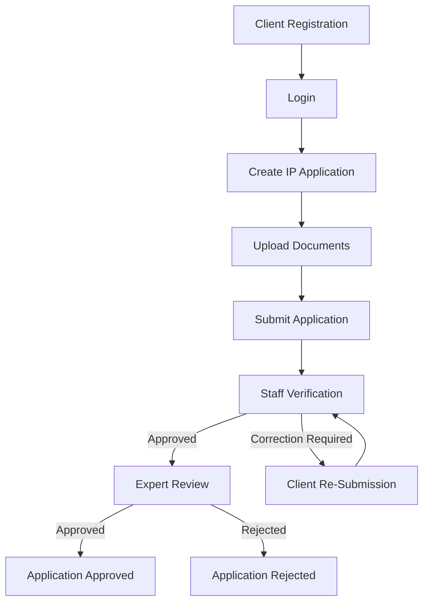

# 🛡️ IPFCMS — Intellectual Property Facilitation Centre Management System

### 🌐 Live Demo: [https://frontend-beige-psi-87.vercel.app](https://frontend-beige-psi-87.vercel.app)

## 📌 Project Overview

**Intellectual Property Facilitation Centre Management System (IPFCMS)** is a full-stack web-based platform developed to efficiently manage and digitize the operations of Intellectual Property Facilitation Centres.

The system streamlines the complete lifecycle of Intellectual Property applications including:

- Patent Registration
- Trademark Registration
- Copyright Registration
- Industrial Design Registration

IPFCMS enables applicants, staff members, legal experts, and administrators to manage applications, documents, reviews, approvals, appointments, payments, and communication through a centralized digital platform.

The platform improves operational efficiency, reduces manual paperwork, enhances transparency, and provides secure workflow management for intellectual property services.

---

# 🚀 Key Objectives

- Digitize Intellectual Property application workflows
- Simplify verification and approval processes
- Enable secure document management
- Improve communication between applicants and experts
- Provide role-based access and monitoring
- Track application lifecycle and status updates
- Reduce processing delays and manual errors

---

# ✨ Core Features

## 🔐 Authentication & Authorization
- JWT-based secure authentication
- Role-Based Access Control (RBAC)
- Protected routes and middleware
- Email verification system
- Password reset using OTP

## 📝 Intellectual Property Application Management
- Multi-step dynamic application forms
- Patent application workflow
- Trademark registration workflow
- Copyright registration workflow
- Industrial Design registration workflow
- Draft save and edit functionality

## 📂 Secure Document Management
- File upload and storage
- Document verification system
- File status tracking
- Secure authenticated downloads

## ⚙️ Workflow & Review Management
- Staff verification process
- Expert review and approval workflow
- Application revision requests
- Approval and rejection handling
- Workflow history and audit tracking

## 📅 Appointment Scheduling
- Consultation booking system
- Appointment approval and rejection
- Schedule tracking and management

## 💳 Interactive Sandbox Payment Gateway
- Sandbox-grade payment simulation (Credit/Debit Card, Net Banking, UPI)
- Premium interactive 3D Flip-Card UI (displays card face flipping to back when editing CVV)
- Fully simulated SMS OTP Verification flow with bank security authorization modal
- Live client-side validation and card brand detection (Visa, Mastercard, RuPay, etc.)
- Auto-updated transaction receipts and application payment status updates

## 💬 Communication & Notifications
- Thread-based support chat system for interaction between Clients, Staff, and Experts
- Interactive file attachments support (.pdf, .jpg, .png, .doc, .docx up to 10MB) in chat queries
- Secure file downloader that authorizes downloads exclusively for chat participants
- Unread status tracking and badge counts per conversation
- Real-time in-app notification system and email-like alerts

## 📊 Admin Dashboard
- User and role management
- Application monitoring
- Analytics and reporting
- Staff approval management

---

# 🏗️ Technology Stack

## Frontend
- React 19
- Vite
- Tailwind CSS
- Axios
- React Router

## Backend
- Laravel 13
- RESTful API Architecture
- JWT Authentication
- Eloquent ORM

## Database
- MySQL

---

# 📂 Project Structure

```text
IPFCMS/
│
├── backend/
│   ├── app/
│   ├── config/
│   ├── database/
│   ├── routes/
│   └── composer.json
│
├── frontend/
│   ├── src/
│   │   ├── assets/
│   │   ├── components/
│   │   ├── context/
│   │   ├── pages/
│   │   ├── services/
│   │   └── App.jsx
│   │
│   ├── public/
│   ├── package.json
│   └── tailwind.config.js
│
└── README.md
```

---

# 🔄 System Workflow



---

# 🗄️ Database Models

| Model | Purpose |
|------|------|
| User | Stores users and roles |
| IpApplication | Main IP application records |
| Patent | Patent-specific information |
| Trademark | Trademark details |
| Copyright | Copyright details |
| IndustrialDesign | Industrial design records |
| Document | Uploaded document records |
| Payment | Payment information |
| Appointment | Consultation scheduling |
| ChatMessage | Messaging system |
| Notification | User notifications |
| WorkflowHistory | Status tracking history |

---

# 🚀 Installation Guide

## Prerequisites

Install the following before setup:

- PHP 8.2+
- Composer
- Node.js 18+
- NPM
- MySQL

---

# Backend Setup

## Navigate to Backend Directory

```bash
cd backend
```

## Install Dependencies

```bash
composer install
```

## Create Environment File

```bash
cp .env.example .env
```

## Configure Database

Update `.env` file:

```env
DB_CONNECTION=mysql
DB_HOST=127.0.0.1
DB_PORT=3306
DB_DATABASE=ipfcms
DB_USERNAME=root
DB_PASSWORD=your_password
```

## Generate Application Key

```bash
php artisan key:generate
```

## Generate JWT Secret

```bash
php artisan jwt:secret
```

## Run Migrations

```bash
php artisan migrate
```

## Start Backend Server

```bash
php artisan serve
```

Backend URL:

```text
http://localhost:8000
```

---

# Frontend Setup

## Navigate to Frontend Directory

```bash
cd frontend
```

## Install Dependencies

```bash
npm install
```

## Start Development Server

```bash
npm run dev
```

Frontend URL:

```text
http://localhost:5173
```

---

# 🔒 Security Features

- JWT Authentication
- Route Protection
- Role-Based Access Control
- Secure File Upload System
- Email Verification
- Password Reset via OTP

---

# 👥 User Roles

| Role | Responsibilities |
|------|------|
| Client | Submit and manage IP applications |
| Staff | Verify applications and documents |
| Expert | Review and approve applications |
| Admin | Manage users and system operations |

---

# 📈 Future Enhancements

- Real-Time WebSocket integration for instant messaging
- SMS & Email Notifications
- Cloud File Storage
- Multi-language Support
- Advanced analytics dashboard

---

# 📄 Conclusion

The Intellectual Property Facilitation Centre Management System provides a secure, scalable, and efficient digital solution for managing Intellectual Property services. The platform automates critical workflows, enhances transparency, and simplifies communication between applicants, staff, and experts.

---

# 👨‍💻 Developed For

Academic Project / Management System Development